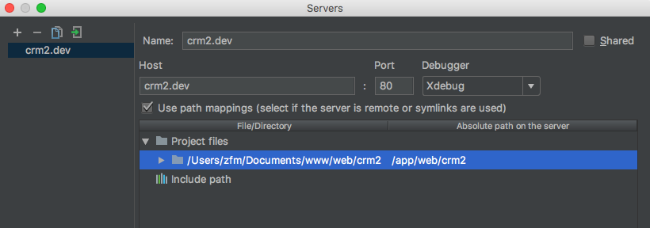
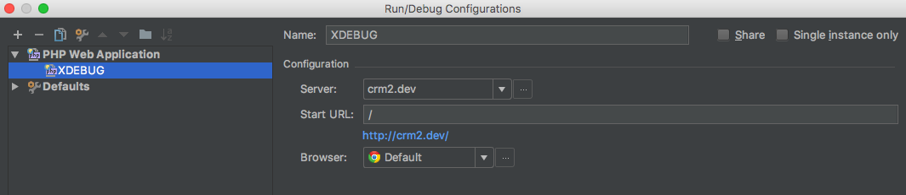
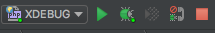

基于docker环境建立的php开发环境，内含xdebug、dnsmasq

自定义镜像：

* [Docker hub => php-xdebug](https://hub.docker.com/r/zfming/php-xdebug/)
* [Docker hub => dnsmasq](https://hub.docker.com/r/zfming/dnsmasq/)

里面已经包含了平常开发所需的基本php扩展，比如gd,pdo_mysql等。

### 前置条件
* 安装好docker和docker-compose

### 目录简介
|目录|简介|
| ----- | ----- |
|app|存放代码的目录|
|data|数据库目录|
|run|docker-compose 的运行目录|
|run/etc|容器运行的配置文件|

		
### 安装

* 获取代码，运行docker-compose：

```bash
git clone git@github.com:zfuming/docker-php-dev.git
cd run/
docker-compose up -d
```

* 添加网卡别名

```bash
sudo -S ifconfig en0 alias 10.254.254.254 255.255.255.0
```

### MAC下Docker容器使用xdebug

* 工具组合
 + IDEA 或者 phpstorm
 + Docker for mac

* docker 容器中的配置

```bash
docker exec -it <容器ID> bash
cd /usr/local/etc/php/conf.d
echo "zend_extension=xdebug.so" >> docker-php-ext-xdebug.ini
echo "xdebug.remote_enable=1" >> docker-php-ext-xdebug.ini
echo "xdebug.remote_host=10.254.254.254" >> docker-php-ext-xdebug.ini
pecl install xdebug
docker-php-ext-enable xdebug
exit
docker restart <容器ID>
```

+ RUN > Edit Configurations > Defaults > PHP Web Application > Server (注意：要勾选use mapping)



+ 在【Edit Configurations】中点击+， 选择【PHP Web Application】Server选择上一步配置的server，点击保存



+ 在代码中打上断点 点击debug

 
 
+ 配置结束